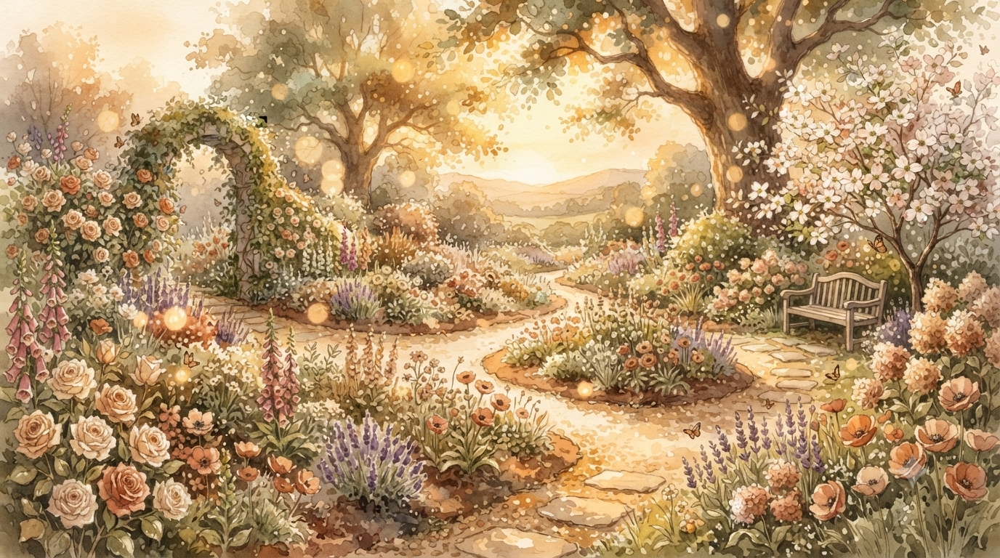
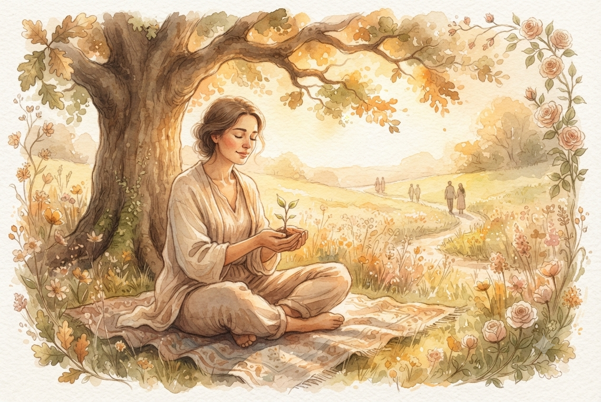
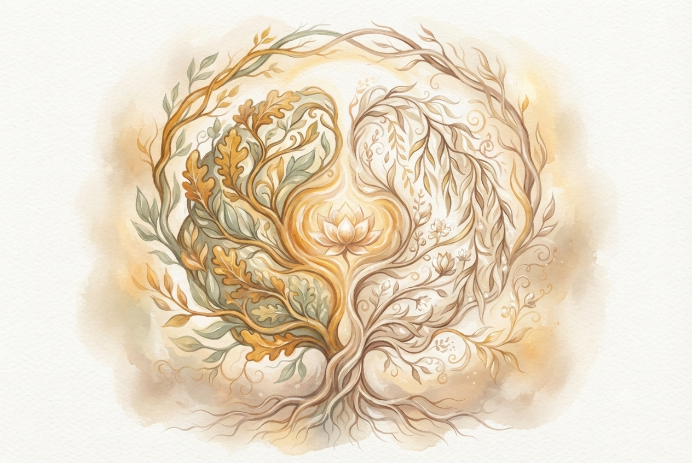
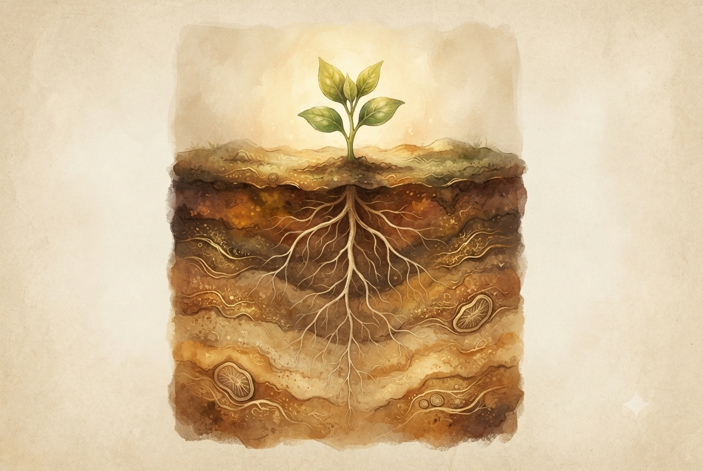
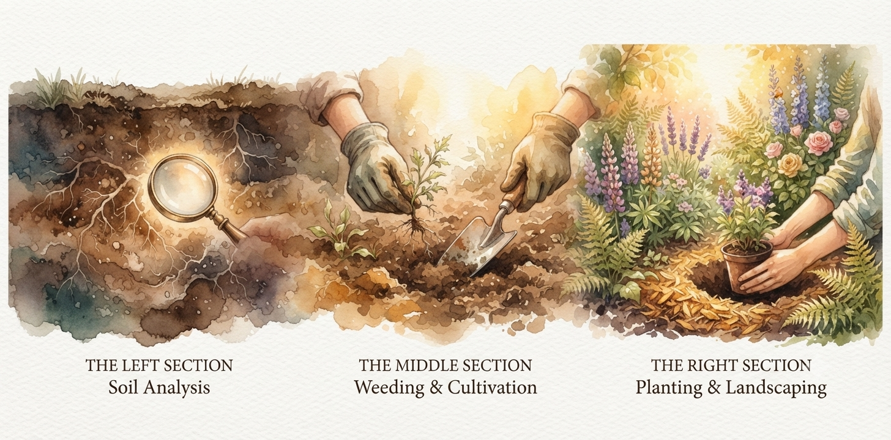

# Képek Manifest

## Összefoglaló

| Kép | Fájlnév | Méret | Alt szöveg (a tényleges index.html szerint) | Szekció | Státusz |
|-----|---------|-------|-----------|---------|---------|
| Hero | hero.jpg | 1920×1080 | Virágzó kert napfényben | #hero | ✅ Feltöltve ⚠️ |
| Life Coaching | coaching.jpg | 1200×800 | Life coaching ülés meleg, bizalmas légkörben | #coaching | ✅ Feltöltve |
| Kineziológia | kinezio.jpg | 1200×800 | Kineziológiai kezelés, izomtesztelés közben | #kinezio | ✅ Feltöltve |
| Recall Healing | recall.jpg | 1200×800 | Nyugodt konzultációs tér a Recall Healing üléshez | #recall | ✅ Feltöltve |
| Kertész metafora | garden-metaphor.jpg | 1600×800 | Gondozott, virágzó kert szimbolikus fényben | #garden-metaphor | ✅ Feltöltve |
| Profil | profile_03.jpg | 400×400 | Szepesi Dániel | #contact (a .contact-info dobozban) | ✅ Feltöltve |

⚠️ **2026-07-05: tartalmi ellentmondás a hero.jpg-nél továbbra is fennáll** – a feltöltött hero.jpg egy festői, virágzó kert-illusztráció (a kertész-metafora témájában), miközben a `#hero` szekció szövege azóta "Rólam" személyes bemutatkozásra cserélődött (lásd PROJECT_BRIEF.md). A kép technikailag jól működik dekoratív háttérként (a gradient overlay miatt a szöveg olvasható rajta), de tartalmilag nem a "Rólam" mondanivalóhoz illik – érdemes eldönteni, hogy marad-e dekoratív elemként, vagy cserélni kell egy személyesebb képre.

📦 **Fájlméretek**: a most feltöltött 5 kép egyenként ~2–2.8 MB (összesen kb. 11.6 MB) – ez elég nagy egy weboldalhoz. Optimalizálás (tömörítés, WebP konverzió) még nem történt meg, lásd a "Következő Lépések" 3. pontját.

---

## AI Generálás Prompt-ok

### hero.jpg
```
A blooming garden in warm sunlight, peaceful yet vibrant.
Warm earth tones, beige, golden, and brown accents, soft cream light.
Painterly, illustrated style — not photorealistic.
Metaphor for growth, healing, natural abundance.
Wide composition, 16:9 aspect ratio.
```

### coaching.jpg
```
Warm, inspiring scene of human connection and personal growth.
Person in peaceful natural environment — park or garden.
Soft natural lighting, serene, inviting atmosphere.
Warm earth tones, beige, golden, and brown, openness and trust.
Illustration or digital art style.
3:2 aspect ratio.
```

### kinezio.jpg
```
Visual metaphor for brain hemispheres and balance.
Symmetrical composition with flowing, harmonious lines.
Integration and wholeness — left and right halves merging.
Warm earth tones, beige and golden accents, peaceful balance.
Symbolic and healing, not medical or clinical.
Illustration style. 3:2 aspect ratio.
```

### recall.jpg
```
Roots, deep earth layers, soil cross-section.
Natural, organic textures — layers beneath the surface.
Warm earth tones: browns, beige, golden highlights.
Metaphor for healing from deep roots.
Peaceful and grounding feeling.
Botanical illustration quality. 3:2 aspect ratio.
```

### garden-metaphor.jpg
```
Illustrative garden in three distinct sections, left to right:
LEFT: Soil analysis — earth layers, microscopic soil view
MIDDLE: Weeding and cultivation — plants being tended, cleared space
RIGHT: Landscaping — blooming garden, flowers, abundance
One cohesive scene showing transformation.
Warm earth tones, beige, golden, and brown accents. Botanical style.
Wide panoramic composition, 2:1 aspect ratio.
```

---

## HTML Képhelyek

*(Az alábbi kód szó szerint az `index.html`-ből – nem terv, a jelenlegi élő markup.)*

### hero.jpg
```html

```

### coaching.jpg
```html

```

### kinezio.jpg
```html

```

### recall.jpg
```html

```

### garden-metaphor.jpg
```html

```

### profile_03.jpg

*(2026-07-05: az eredeti profile.jpg lecserélve profile_03.jpg-re – a régi fájl megmaradt a repóban, de már nincs használatban)*

```html

```

---

## CSS Osztályok

*(Az alábbi kód pontosan a `css/style.css`-ben lévő, ténylegesen élő definíció – nem terv.)*

```css
/* A .hero-image a #hero teljes hátterét tölti ki, a szöveg olvashatóságáért
   a #hero::before egy 0.85 opacitású zöld gradienst rak rá overlay-ként. */
#hero {
  position: relative;
  overflow: hidden;
}

.hero-image {
  position: absolute;
  inset: 0;
  width: 100%;
  height: 100%;
  object-fit: cover;
  background: var(--color-primary-dark);
  z-index: 0;
}

#hero::before {
  content: '';
  position: absolute;
  inset: 0;
  background: linear-gradient(135deg, var(--color-primary-light), var(--color-primary-dark));
  opacity: 0.85;
  z-index: 1;
}

.section-image {
  display: block;
  width: 100%;
  max-width: 700px;
  aspect-ratio: 16 / 9;
  object-fit: cover;
  background: var(--color-border);
  border-radius: 8px;
  box-shadow: var(--shadow-light);
  margin: 0 auto var(--spacing-lg);
}

.profile-image {
  display: block;
  width: 120px;
  height: 120px;
  object-fit: cover;
  border-radius: 50%;
  border: 4px solid var(--color-white);
  box-shadow: var(--shadow-light);
  margin: 0 auto var(--spacing-md);
}
```

Nincs külön mobil (`@media max-width: 768px`) felülírás sem a `.section-image`-re, sem a `.profile-image`-re – a `.section-image` a `max-width:700px` és a `width:100%` kombinációja miatt magától zsugorodik, a `.profile-image` mérete (120×120px) minden képernyőméreten fix marad.

---

## Státusz

- ✅ Feltöltve: mind a 6 kép (hero, coaching, kinezio, recall, garden-metaphor, profile)
- ⚠️ Nyitott kérdés: hero.jpg tartalmi illeszkedése a "Rólam" szöveghez (lásd fentebb)

## Következő Lépések

1. [x] AI képek generálása (fenti promptokkal)
2. [x] /images mappába mentés
3. [ ] Ellenőrzés: img tagek src helyes-e (a fájlnevek egyeznek, vizuálisan a hero.jpg-t ellenőriztem – kert-illusztráció, jól betölt)
4. [ ] Responsive tesztelés képekkel (mobil nézetben még nem ellenőriztük élesben)
5. [ ] Optimalizáció (WebP, tömörítés, lazy loading) – a jelenlegi fájlok ~2–2.8 MB-osak, ez még nincs optimalizálva
6. [ ] Döntés a hero.jpg témájáról (marad kert-illusztráció, vagy személyesebb kép kerüljön a helyére)

*Utolsó frissítés: 2026-07-05*
